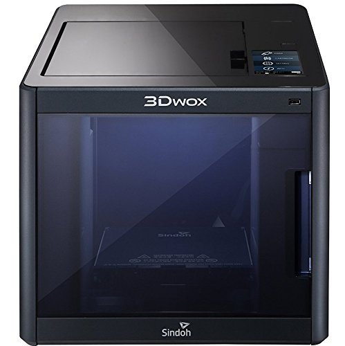
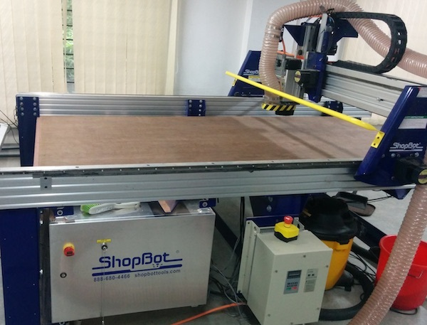
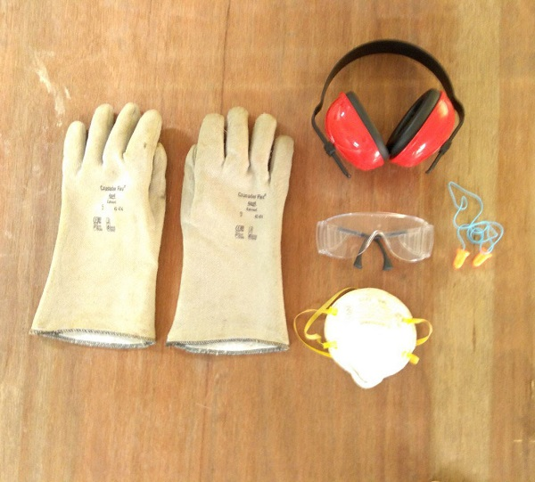
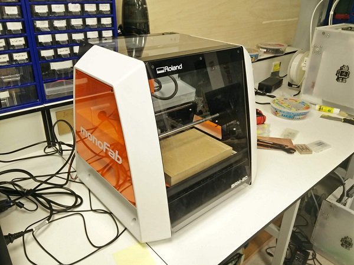
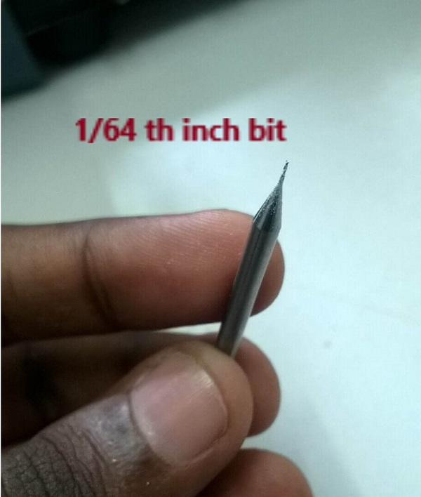
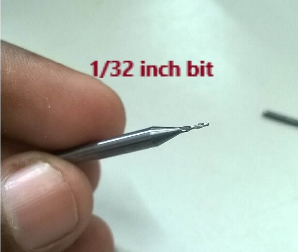
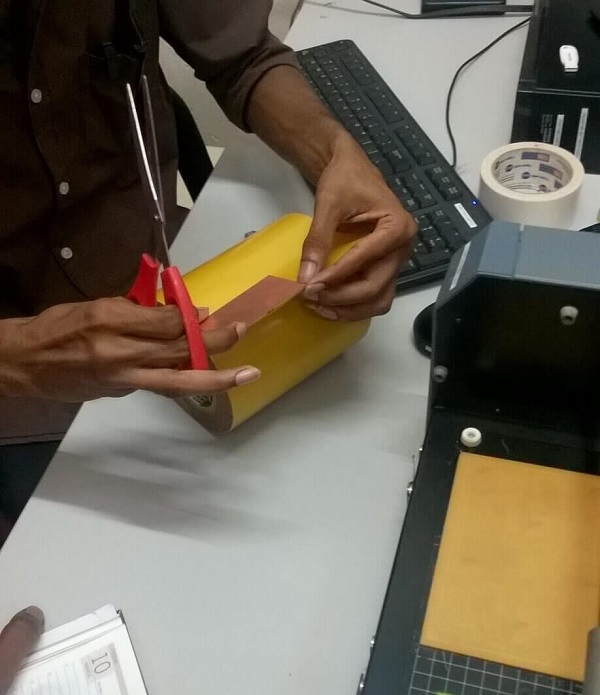

# Maruthi Prasad fabzero experience

FabZero program is being organised at the Elite building of Software Technology Parks of India (STPI), Bhubaneswar, India from 18th March 2019 to 5th April 2019. The program is attended by technical teams from STPI centres across the country. The trainees are being mentored by Mr. Francisco Sanchez and Mr.Sibu Saman. The team of experts from Fab Academy has vast experience in setting up Fab labs and have conducted many training programs across India and abroad. Mr Sanchez also started Beach Lab, a mobile research and development Fab Lab in Digital fabrication and Synthetic biology.

After the launch of the FabZero, Bhubaneswar by Dr. Omkar Rai, Director General, Software Technology Parks of India (STPI) through video conferencing, the session kick started. It is heartening to know the possibility of STPI setting up new Fablabs across the country with the cooperation of respective State Government.

Fabzero program is a precursor to the 6 months diploma program of Fablab Academy. Hoping to learn to make (almost) everything at the Fablab during this session.

# Day 1 at Fablab  (18/03/19)

After that we had lunch break   
We had tour to the Fablabs situated at First Floor 

List of the equipments available in the Fablab are : 
- Vinyl Cutter 
- Laser cutter
- Carbon filter
- 3D printers  
- Milling machine
- Microscope Camera
- Electronic equipments like
- Oscilloscope
- Functioin Generator
- Power supply
- Automatic scroll machine 
- Object waterjet
- Desoldering gun

 After that we had a Tea break for 15minutes
 Then we created Github account - Repository - Fabzero

 ## Day 2 at Fablab (19/03/19)
 
 Mentor instructed to install the follo/wing softwares in our laptop
 - Code Spell checker
 - inkscape software
 - cura software and 
 - git for windows
 
 Then we created username and user email in the git login
 After the Successfull installation we did cloning of the readme file by copying the address and then
 we tried updating the file and then we saved the file by commit and then pushing the file to the 
 repository. 
 Then we have started taking pictures of the equipment's and uploading in the repository. After that we had lunch break. 
 After the lunch break we sorted out inventory of electronic devices.
 Next Mentor briefed us about the functionality of the 3D Printer, unloading of the filament, cleaning of 
 the waste, cooling procedure of the printer, etc.
 And next Mentor briefed us about the Vinyl cutter, how to load the sheet, how to keep the edge points on
 the sheet.
 Next we had tea break.
 We installed 3DWOX software for 3D printing
 Did all the documentation of today's work in the repository.

 ## Day 3 at Fablab (20/03/19)

 Started the day with the installation of Kicad software. Its useful for the designing the electronic circuit boards. Learnt the functionality of the Kicad software. After that we had Lunch break.

 After that we had hands on the Vinyl cutter. We wrote our name in the inkscape software and then converted that image to the bitmap format. Mentor informed about the fabmodules.org with this software we can print our names, logo, design, etc. I printed a 3D design model of compass

 ## Day 4 at Fablab (21/03/19)

 Mentor instructed to install the Freecad software. Then Mentor Mr.Shibu taught us about the designing of the electronic circuit board. We did the designing in the Kicad software. Next we tried printing the few 3D models of other colleagues.

 ## Day 5 at Fablab (25/03/19)

 Today mentor discussed about the importance of few topics as below :
 - Supply vs Demand time
 - Freecad 3D
 - KiCAD - PNG 
 - Documentation
 - Programming
 - 3D Scanning
 - Moulding and Casting

 Mentor Mr.Shibu informed about the PCB design. And also he explained about the Programming concepts. 

 ## Day 6 at Fablab (26/03/19)
 
 Today we started with introduction to ShopBot. The Shopbot is a CNC that can cut materials like wood, acrylic and even soft metals. Based on the design, you can cut 2D and 3D files.  This CNC delivers affordable, full-production performance in digital fabrication of wood, plastic, aluminum, and other materials. 

 
  
 In order to use the machine, three different software components are used: 
 - A design software like Rhino to model 2D or 3D shapes.
 - Vcarve pro software to create the toolpath for the machine.
 - Shopbot software to set the origin for the machine and feed the toolpath file.

# How to Use Shopbot?
- Loading Design
- Open or Import the vector design
- Select the regions to VCarve or machine
- Specify the tool details and calculate tool paths
- Preview the job in any material
- Save the CNC code (save the tool paths)
# Turning it on - checklist
- Flip the big switch on the front (cooling fan on spindle will turn on)
- Press reset button on pendant (VFD will turn on)
- Set VFD to 150.0
- Turn on Shopbot 3 software
# Zeroing the table
- Use hand control window to move bit to it's zero point
- In the main window, select zero->zero three axis
- Move z axis to safe height
# Emergencies
- There are two emergency stop buttons that you can hit
- You can press space on the keyboard
- You can click with the mouse

 # Safety Precautions
 Safety always comes first when we are gonna use CNC machines or other big machines anywhere. We always double check the safety gears when using CNC machines in Fablab. Here is the Safety Gears we use in our Fablab.
- SAFETY GLOVES
- SAFETY GOGGLES
- EAR MUFFS PROTECTORS
- EAR PLUGS
- DUST MASKS

 

# PCB Fabrication
PCB or Printed circuit boards are circuit boards having copper clading which mechanically supports and electrically connects different electrical components.There are single side PCB's,double sided PCB's as well as multi layered PCB's available.In single side PCB's we have a copper layer above a substrate of non conducting layer.In double sided PCB's we have two layers of copper at top and bottom of the substrate whereas in multi layered PCB's we have alternating layers of copper between substate layers.In our lab we are using FR-1 type which is a single side PCB.In PCB's we can remove the copper and create circuit pathways by different methods like milling ,etching,plating,lamination etc.,in our lab we will be using the milling operation using Roland Model SRM 20.

 

Roland model SRM 20 is a desktop version of the PCB milling machine available at our fab lab.It is compatible with most of the 2D and 3D CAD softwares. It has a small bed which moves in the Y-axis, a Tool head which moves in the X-axis and a bit attached to it moving in Z-axis.We are using Fab Module software to operate the machine. The input is mainly .png and output is .rml file. Image is always a black and white layout of the board, the black portions will be milled and the white portion is where the copper will be left.The main operations performed by this machine are:

- milling -to mill traces to get the circuit board pattern using the 1/64th inch (0.4mm) bit.
 
- cutting -to cut out the board from the base copper clad using the 1/32th (0.8mm) inch bit.
 
  
# Setting up the machine and PCB milling
The setting and operations of the milling machine are as follows:

 1).The machine has a base metal plate on to which we have to paste the PCB for cutting.So in between the metal plate and the PCB we have to put some layer to reduce the risk of bit hitting the plate.this layer is known as sacrificial layer.You can use another PCB as sacrificial layer. 

 2).The PCB as well as the sacrificial layer is fixed to the base plate by using double sided tape.We should be careful that while pasting there should not be any air bubble as this slight variation in level can affect the milling operation.

 

 3).Switch on the machine,load the fab modules(we are using the offline version in our lab). Select the trace for milling,give the output option and for tracing choose 1/64 bit.
  Now for milling the offset ,speed and depth are already set we just have to note down the x and y position for performint the cutting operation.

4).Now press the view button on the machine.The plate will come front and the head will move to right.load the 1/64 inch bit to the head .While loading the bit always put a sponge at the bottom to add an extra safety for the bit, if it falls.We are using allen key to fix the bit on position. 

5).Now press the view button again to move to (0,0)position.Use the x and y values in the print manager(fab modules) to correct the position of bit with the PCB.It is actually a kind of trail and error process.

6).Recheck the space left in the Z axis for the bit to move down,also if the bit is touching the material and start the operation.

7).After milling operation, load the png file for cut.
- load the 1/32 bit,give the x and y values and perform the cutting operation.

8).After the operation we have to vaccum down the dust using a vaccum cleaner.

## Day 7 at Fablab (27/03/19)
We did the soldering to the PCB. The components used are
- Resistors - 500 ohm (2 no's)
- Resistors - 10k (2 no's)
- Capacitor 1 microfarad (1 no)
- LED (2 no's)
- Microcontroller (1 no)
- Switch Button (1 no)
- ISP header (1 no)

## Day 8 at Fablab (28/03/19)

 

