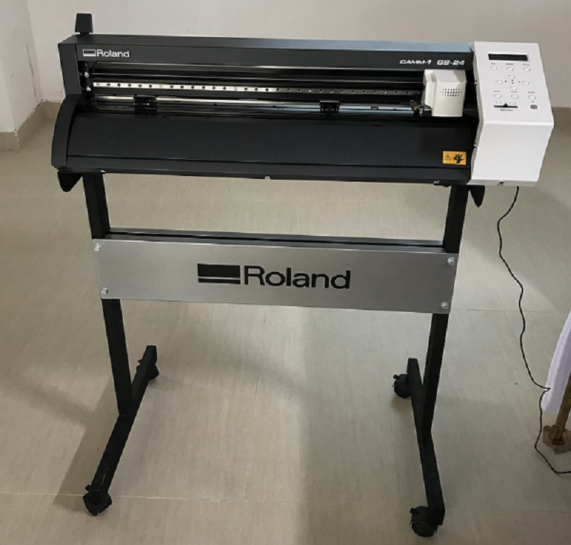
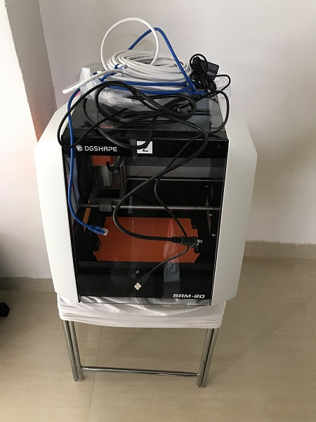

# Maruthi Prasad fabzero experience

Hello I am Maruthi Prasad 

## Introduction (18.03.19)
- Day 1 @ Fablab  

At 11AM inaguration of Fablabs by DG and inagural speech by STPI-Bhubaneshwar Director   
Colleagues from different STPI centres introduced themselves
We had a brief description on Fablabs by Mentors Mr.Francisco and Mr.Shibu

After that we had lunch break   
We had tour to the Fablabs situated at First Floor 
brief explaination about the equipments were given by Mentor- 
- Vinyl Cutter

- Vinyl cutter is a computer controlled cutting machine.Its working is same as a printer.Like a printer controls a nozzle,the computer controlsthe movement of asharp blade over the surface of the material.This blade is used to cut out shapes and letters from sheets of thin self adhesive plastics. 

- To cut out the design a vector based image must be created in software programme.It is then sent to the cutter where it cuts along the vector path laid out in the design.The major limitations with vinyl cutter is that they can only cut shapes from solid colors of vinyl. 

- In our fab lab we use Roland vinyl cutter.It has a sharp blade to cut the materialsand it can move in X and Y axis.Tha commonly used materials in vinyl cutter is vinyl sheet ,paper etc Our instructor gave us an introduction to the Roland vinyl cutter and information on how to set up the machine like setting the origin, changing the material types to roller or pieces, he even demonstrated a test cut to show us the procedures involved.We used the Fab module in ubuntu to set up the file and to adjust the cutting force and speed. Our instructor also showed us how to transfer the pieces of vinyl to the required surface using a masking tape.

- Laser cutter
- Carbon filter
- 3D printers 
- A 3d printers can create a physical model of virtually any shape through the extrusion of plastic based filament (PLA, ABS). There are a few different printers available within the Lab.

- Milling machine
- Microscope Camera
- Electronic equipments like
- Oscilloscope
- Functioin Generator
- Power supply
- Automatic scroll machine 
- Object waterjet
- Desoldering gun

 After that we had a Tea break for 15minutes
 Then we created Github account - Repository - Fabzero

 ## Day 2 at Fablab (19/03/19)
 
 Mentor instructed to install the follo/wing softwares in our laptop
 - Code Spell checker
 - inkscape software
 - cura software and 
 - git for windows
 
 Then we created username and user email in the git login
 After the Successfull installation we did cloning of the readme file by copying the address and then
 we tried updating the file and then we saved the file by commit and then pushing the file to the 
 repository. 
 Then we have started taking pictures of the equipment's and uploading in the repository. After that we had lunch break. 
 After the lunch break we sorted out inventory of electronic devices.
 Next Mentor briefed us about the functionality of the 3D Printer, unloading of the filament, cleaning of 
 the waste, cooling procedure of the printer, etc.
 And next Mentor briefed us about the Vinyl cutter, how to load the sheet, how to keep the edge points on
 the sheet.
 Next we had tea break.
 We installed 3DWOX software for 3D printing
 Did all the documentation of today's work in the repository.

 ## Day 3 at Fablab (20/03/19)

 Started the day with the installation of Kicad software. Its useful for the designing the electronic suecreek boards. Learnt the functionality of the Kicad software. After that we had Lunch break.

 After that we had hands on the Vinyl cutter. We wrote our name in the inkscape software and then converted that image to the bitmap format. Mentor informed about the fabmodules.org with this software we can print our names, logo, design, etc. I printed a 3D design model of compass

 ## Day 4 at Fablab (21/03/19)

 Mentor instructed to install the Freecad software. Then Mentor Mr.Shibu taught us about the designing of the electronic circuit board. We did the designing in the Kicad software. Next we tried printing the few 3D models of other colleagues.

 ## Day 5 at Fablab (25/03/19)

 Today mentor discussed about the importance of few topics as below :
 - Supply vs Demand time
 - Freecad 3D
 - KiCAD - PNG 
 - Documentation
 - Programming
 - 3D Scanning
 - Moulding and Casting

 Mentor Mr.Shibu informed about the PCB design. And also he explained about the Programming concepts. 

 ## Day 6 at Fablab (26/03/19)
 
 Today we started with introduction to ShopBot. The Shopbot is a CNC that can cut materials like wood, acrylic and even soft metals. Based on the design, you can cut 2D and 3D files.  This CNC delivers affordable, full-production performance in digital fabrication of wood, plastic, aluminum, and other materials. 

 
  
 In order to use the machine, three different software components are used: 
 - A design software like Rhino to model 2D or 3D shapes.
 - Vcarve pro software to create the toolpath for the machine.
 - Shopbot software to set the origin for the machine and feed the toolpath file.

# How to Use Shopbot?
- Loading Design
- Open or Import the vector design
- Select the regions to VCarve or machine
- Specify the tool details and calculate tool paths
- Preview the job in any material
- Save the CNC code (save the tool paths)
# Turning it on - checklist
- Flip the big switch on the front (cooling fan on spindle will turn on)
- Press reset button on pendant (VFD will turn on)
- Set VFD to 150.0
- Turn on Shopbot 3 software
# Zeroing the table
- Use hand control window to move bit to it's zero point
- In the main window, select zero->zero three axis
- Move z axis to safe height
# Emergencies
- There are two emergency stop buttons that you can hit
- You can press space on the keyboard
- You can click with the mouse

  

 

